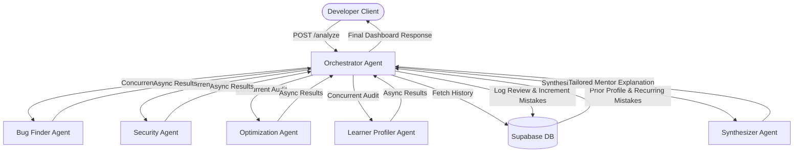

# AI Code Mentor Agent

> A multi-agent system that reviews your code like a senior mentor, remembers your mistakes, and adapts to your skill level.

---

## 🚀 Live Demo & Project Links

*   **Frontend Client**: `https://[your-frontend-vercel-url].vercel.app`
*   **Backend API Health Check**: [https://code-sage-ai-inky.vercel.app/health](https://code-sage-ai-inky.vercel.app/health)
*   **Demo Video**: `[Placeholder: Paste YouTube/Loom Link Here]`

---

## ❓ Problem Statement

Aspiring and self-taught software developers face a significant bottleneck: the lack of access to personalized, expert guidance. While learning syntax is relatively easy through tutorials, understanding software design patterns, security implications, and optimization strategies requires feedback from experienced senior mentors. Traditional education or bootcamp paths offer this mentoring, but they are expensive, creating a learning gap for underprivileged self-taught developers.

Static analysis tools and generic linters (like Pylint, ESLint, or SonarQube) fail to bridge this gap. They print dry, robotic warnings that catch syntax problems but fail to explain *why* a particular design pattern is flawed. Furthermore, standard linters have no memory: they treat a developer who makes a mistake for the first time the same as a developer who has repeated the same bad habit ten times. They cannot adapt their vocabulary or explanations to match a learner's progress.

This project was built to democratize high-quality code mentorship. By leveraging a multi-agent AI architecture with persistent memory, we simulate a senior software engineer who understands your current skill level, remembers your recurring coding mistakes, and explains corrective concepts in a way that grows with you.

---

## 💡 Solution Overview

The **AI Code Mentor Agent** is a multi-agent code analysis pipeline that splits review concerns across specialized AI roles, orchestrates them concurrently, and synthesizes their findings with persistent user memory:

*   **Concurrent Multi-Agent Inspection**: When a developer submits a code snippet, an **Orchestrator Agent** broadcasts the code to four specialized async sub-agents. The **Bug Finder Agent** audits logical errors, the **Security Agent** scans for vulnerabilities, the **Optimization Agent** checks time/space complexity, and the **Learner Profiler Agent** dynamically evaluates the developer's skill category (beginner, intermediate, advanced) and explanation preferences.
*   **Persistent Learning Loops (Supabase Memory)**: Every analysis is logged to a centralized Postgres database. The system tracks a developer's profiling history and counts their occurrences of specific mistake categories (like uncontrolled recursion, unclosed file resources, or hardcoded API credentials).
*   **Skill-Tailored Explanations (Synthesizer Agent)**: A final **Synthesizer Agent** receives the raw outputs of the analysis agents along with the developer's historical mistake log. It compiles a comprehensive, personalized mentor response. If the developer is classified as a *beginner*, the synthesizer avoids dry technical jargon and explains concepts using visual analogies. If the developer has repeated a mistake category multiple times, the synthesizer flags it with a custom warning: *"We noticed you've run into this infinite recursion pattern before—let's make sure it sticks this time!"*

---

## 🛠️ Architecture & Tech Stack



### Backend (Python/FastAPI)
*   **FastAPI**: Async ASGI web framework.
*   **Google GenAI SDK**: Calling `gemini-2.5-flash` concurrently for high-speed multi-agent analysis.
*   **Supabase Python Client**: Real-time CRUD operations against PostgreSQL tables.
*   **Logging**: Custom local & stream handlers optimized to run on serverless platforms.

### Frontend (React/Vite)
*   **React (useState, useRef, useEffect)**: Responsive state management.
*   **Vite**: Frontend build system.
*   **Vanilla CSS**: High-performance, custom-themed UI dashboard utilizing a clean modern cyber-dark style.

---

## 🚀 Setup & Local Running

### Prerequisites
*   Python 3.10+
*   Node.js 18+
*   Supabase Account (Free Tier)
*   Gemini API Key (Free Tier)

### 1. Backend Setup
Navigate into the `project/` directory:
```bash
cd project
python -m venv venv
source venv/bin/activate  # On Windows: .\venv\Scripts\activate
pip install -r requirements.txt
```

Create a `.env` file inside `project/` and add your keys:
```text
GEMINI_API_KEY=your_gemini_key
SUPABASE_URL=your_supabase_url
SUPABASE_KEY=your_supabase_key
USE_MOCK_RESPONSES=false
SIMULATE_QUOTA_ERROR=false
```

Start the FastAPI backend server:
```bash
uvicorn app:app --reload
```

### 2. Frontend Setup
Open a new terminal and navigate into the `frontend/` directory:
```bash
cd frontend
npm install
```

Create a `.env` file inside `frontend/` pointing to your local backend server:
```text
VITE_API_URL=http://localhost:8000
```

Start the React development server:
```bash
npm run dev
```

Open `http://localhost:5173` in your browser.

---

## 🛡️ Production Deployment

### Backend (Vercel Serverless)
The backend includes a pre-configured [vercel.json](file:///c:/Users/narut/OneDrive/Desktop/kaggle%205%20day/project/vercel.json) file that deploys the FastAPI app onto Vercel Serverless Functions. 
*   Add Environment Variables in Vercel project settings: `GEMINI_API_KEY`, `SUPABASE_URL`, `SUPABASE_KEY`, `USE_MOCK_RESPONSES=false`, and `PRODUCTION_FRONTEND_URL` (points to your deployed Vercel frontend for CORS validation).

### Frontend (Vercel)
*   Link your GitHub repository to Vercel.
*   Set the **Root Directory** settings to `frontend/`.
*   Add the `VITE_API_URL` environment variable pointing to your deployed Vercel backend URL.
